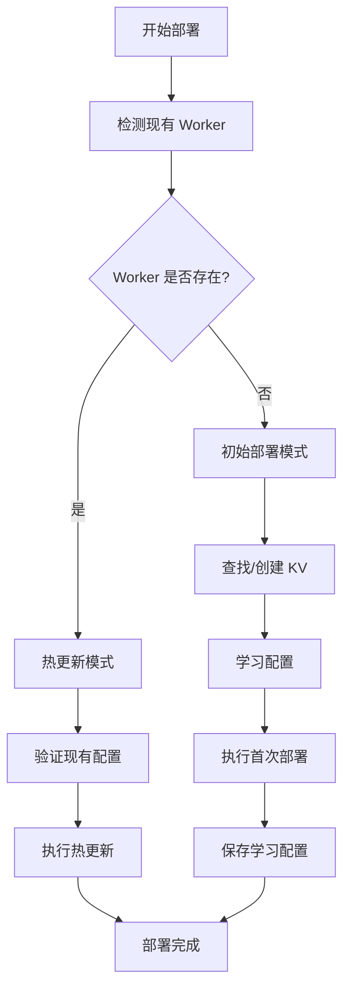

# 🧠 智能部署系统

本项目实现了一个智能的 Cloudflare Workers 部署系统，能够根据现有部署状态自动选择部署模式，并从已部署的 Worker 中学习配置信息。

## 🚀 部署模式

### 1. 初始部署模式 (Initial Deployment)
- **触发条件**: 当检测到没有对应名称的 Worker 时
- **行为**: 
  - 创建或查找合适的 KV 命名空间
  - 执行首次完整部署
  - 学习并保存配置信息
  - 自动提交学习到的配置

### 2. 热更新模式 (Hot Update)
- **触发条件**: 当检测到已存在同名 Worker 时
- **行为**:
  - 从 `wrangler.toml` 读取现有配置
  - 验证配置的有效性
  - 执行快速热更新部署
  - 保持现有配置不变

## 🔍 智能检测流程



## 📋 配置学习机制

### 自动学习内容
1. **KV 命名空间 ID**: 从现有部署或创建新的 KV 空间
2. **Worker 配置**: 验证 `wrangler.toml` 中的设置
3. **绑定关系**: 确保 KV 绑定名称正确

### 配置保存
- 学习到的配置会自动更新到 `wrangler.toml`
- 通过 Git 自动提交配置变更（带 `[skip ci]` 标记）
- 生成 `deployment-info.json` 记录部署元数据

## 🛡️ 安全特性

- **敏感信息保护**: KV ID 等敏感信息不会在日志中暴露
- **配置验证**: 自动验证配置的有效性
- **错误处理**: 提供详细的错误诊断信息
- **回滚能力**: 基于现有配置的安全回滚

## 📊 部署信息记录

每次部署都会生成 `deployment-info.json` 文件，包含：

```json
{
  "deployment_mode": "update|initial",
  "worker_exists": "true|false", 
  "namespace_name": "custom_hosts",
  "binding_name": "custom_hosts",
  "config_updated": "true|false",
  "deployment_time": "2024-01-01T00:00:00Z",
  "run_number": "123"
}
```

## 🎯 使用场景

### 首次部署
1. 手动部署一次或让 CI/CD 自动检测
2. 系统自动学习部署配置
3. 后续推送将使用热更新模式

### 配置更改
1. 修改 `wrangler.toml` 中的配置
2. 推送代码触发部署
3. 系统验证配置并执行相应部署

### 环境迁移
1. 新环境下首次运行会进入初始部署模式
2. 自动创建所需资源
3. 学习并保存新环境的配置

## 🔧 故障排除

### 常见问题

1. **KV 命名空间不存在**
   - 系统会自动查找现有的 `custom_hosts` KV
   - 如果不存在会自动创建新的
   - 配置会自动更新到 `wrangler.toml`

2. **部署权限问题**
   - 检查 `CLOUDFLARE_API_KEY` 和 `CLOUDFLARE_EMAIL` 是否正确设置
   - 确保 API Key 有足够的权限

3. **配置不一致**
   - 系统会自动检测并修复配置不一致
   - 必要时会从现有部署重新学习配置

## 📈 监控和日志

- 所有部署操作都有详细的日志记录
- 敏感信息已脱敏处理
- 部署信息保存为 GitHub Artifacts
- 支持手动触发部署进行调试

## 🎉 优势

1. **智能化**: 自动识别部署状态，选择最优部署策略
2. **安全**: 保护敏感信息，提供配置验证
3. **灵活**: 支持多种部署场景和环境
4. **可靠**: 具备错误恢复和配置学习能力
5. **透明**: 详细的日志和状态记录

这个智能部署系统让您可以专注于代码开发，而无需担心复杂的部署配置管理！
